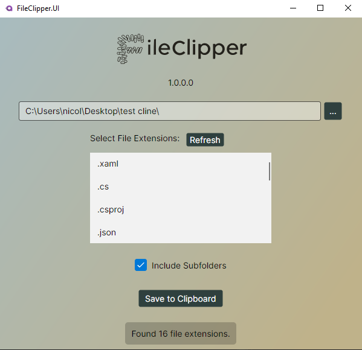

# 📋 FileClipper

**FileClipper** is a lightweight desktop utility built with Avalonia UI that allows you to scan directories for files of specific types, preview their extensions, and copy their full contents — including metadata — to your clipboard in a structured format.

---

## 🚀 Features

* Select a folder to scan.
* Recursively find files by their extensions.
* View all unique file extensions found in the directory.
* Select which file types to include.
* Copy file paths and contents to clipboard with formatting.
* Built with cross-platform Avalonia UI and MVVM pattern.

---

## 🖼️ UI Overview



---

## 🛠️ Built With

* [.NET 8](https://dotnet.microsoft.com/)
* [Avalonia UI](https://avaloniaui.net/)
* [CommunityToolkit.Mvvm](https://learn.microsoft.com/en-us/dotnet/communitytoolkit/mvvm/)
* Dependency Injection via `Microsoft.Extensions.DependencyInjection`
* [xUnit](https://xunit.net/) and [NSubstitute](https://nsubstitute.github.io/) for unit tests.

---

## 🧑‍💻 How It Works

1. **Startup**:

   * `Program.cs` starts the app with Avalonia.
   * `App.axaml.cs` configures services and the main view.

2. **ViewModel Logic**:

   * `MainViewModel`:

     * Handles folder selection, filtering, clipboard logic.
     * Uses `IFileService` for file operations.

3. **FileService**:

   * Gathers all files by extension.
   * Reads content and structures clipboard text.

4. **Clipboard Output Format**:

   ```txt
   ====== Start of SomeFile.cs ======
   File path : C:\Path\To\SomeFile.cs
   File size : 1000 bytes
   Last Modified: 01/01/2000 00:00:00
   File content:

   (file contents here)

   ====== End of SomeFile.cs ======
   ```

---

## 📦 Getting Started

### Prerequisites

* [.NET 8 SDK](https://dotnet.microsoft.com/en-us/download/dotnet/8.0)
* A compatible IDE (e.g., [Rider](https://www.jetbrains.com/rider/), [Visual Studio](https://visualstudio.microsoft.com/), [VS Code](https://code.visualstudio.com/))

### Running the App

```bash
# Navigate to the desktop UI project folder
cd FileClipper.UI.Desktop

# Run the application
dotnet run
```

---

## 📁 Project Structure

```text
FileClipper/
├── FileClipper.UI/             # Main UI logic
│   ├── Services/               # File reading and formatting logic
│   ├── ViewModels/            # MVVM ViewModels
│   └── Views/                 # Avalonia Views
├── FileClipper.UI.Desktop/    # Platform-specific launcher
```

---

## 🧪 Testing

Currently, no unit tests are defined. Recommended to add:

* Unit tests for `FileService`
* MVVM command tests with mocks

---

## 📌 Future Improvements

* ✅ Add dark/light themes
* 💾 Save user preferences (e.g., last folder)
* 🧩 Drag & drop support

---

## 📃 License

MIT
